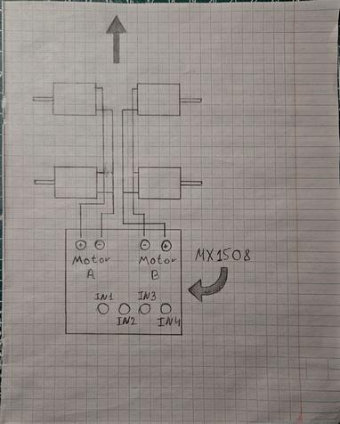

# Инструкция по сборке
**Это максимально просто**, но если не понятно, то загляните в папку Images - там все схемы.

## Пункт первый - драйвер (схема с драйвером)

1. Припаять к драйверу mx1508 на выходы in1-4(или int1-4) 4 провода-джампера с разъёмом, подходящим к пинам на плате расширения.
2. Спаять 2 моторчика. 1 выход моторчика к одному обычному проводу, второй выход к другому. Аналогично со вторым моторчиком.
3. Припаяйте эти конструкции к выходам motor-a + - и motor-b - +.
4. Припаяйте по проводу к выходам + и -.

## Пункт второй - контроллер
Присоедените провода выходов in1-4 к портам на плате расширения D26, D27, D31, D32.

## Пункт третий - питание
Подключите аккумулятор к проводам драйвера + - напрямую. С esp32 сложнее: если питать контроллер больше, чем от 5V, то контроллер сгорит. Используйте понижающий преобразователь напряжения. Получается у вас от аккумулятора на драйвер идут провода напрямую, а к esp32 через преобразователь.
