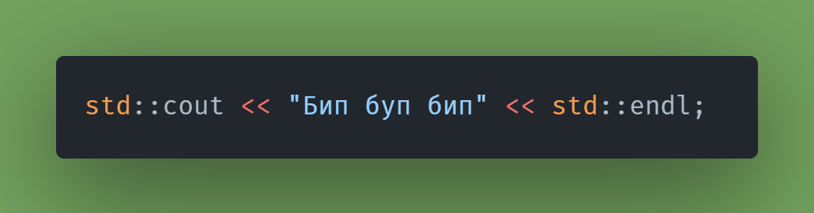
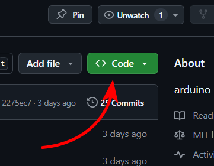
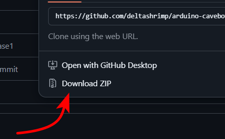
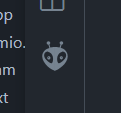
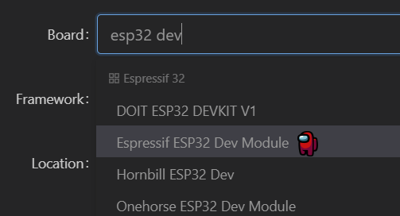
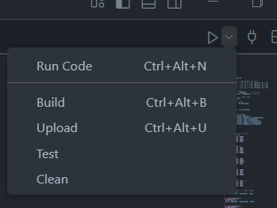

# esp32-cavebot
esp32 based robot speleologist

**Добро пожаловать в репозиторий про робота-исследователя. Собрав его вы сможете исследовать труднодоступные места или искать вещи под диваном.**

## Файловая структура
- **Source** - исходники кода, который надо загрузить на arduino и все 3д модели
    - **Code** - код, который надо загрузить на микроконтроллеры
    - **3D models** - 3д модели (файл .blend для Blender 3D и файл .stl для печати)
- **Papers** - всякие бумажки типа лицензии, инструкции и т.д.
- **Images** - картинки
---
Для сборки проекта **необходимы**:
- Компьютер(или телефон на андроиде)
- Припой для паяльника
- Кусачки и нож
- Мультиметр
- Базовые знания в программировании(в случае если придётся редактировать код)
- Базовое умение работать с паяльником

Опционально:
- Держатель для паяльника
- 3д принтер
- Программа слайсер

## Вопросы и ответы
Весь код был написан в **VS Code** через **Platform IO IDE**, а не через arduino ide. Код может отличаться, но не сильно.  

### Как скачать проект?
Если на главной странице нет кнопки "скачать", то вот так

### Где скачивать программы?
На официальных сайтах:
<a href = "https://www.blender.org/download/">Blender</a>, <a href = "https://code.visualstudio.com">VS Code</a>, <a href = "https://www.arduino.cc/en/software">Arduino IDE</a>, <a href = "https://ultimaker.com/software/ultimaker-cura/">UltiMaker Cura (для 3д печати)</a>.

### Это сложно?
Укладка проводов может быть трудной, а тонкие провода могут порваться.

### Сколько стоит проект?
Актуально в марте 2025 года на сайте ozon.kz

| Компонент | Цена |
|-----------|------|
| Esp32-wroom | 3458 ₸ |
| Esp32-cam | 6467 ₸ |
| Аккумулятор 7.4 вольт (литиевый) | 4390 ₸ |
| Драйвер mx1508 | 1179 ₸ |
| Конденсатор 470 мкФ | 1152 ₸ |
| DC DC понижающий преобразователь | 911 ₸ |
| Провода для пайки | 2375 ₸ |
| Провода джамперы 120 штук | 2435 ₸ |
| **Итого** | **22367 ₸** |

Также можно купить их на aliexpress. Выйдет дешевле, но может приехать бракованная деталь. 
### Как загрузить код?
#### Arduino IDE
1. Скачайте программу
2. <a href="https://lastminuteengineers.com/esp32-arduino-ide-tutorial/">Здесь</a> написано как добавить всё необходимое
3. В окне **Tool** выберите
#### VS Code
1. Скачайте программу
2. Внутри установите расширение
3. Нажмите сюда

Затем сюда

Затем сюда

Введите название проекта и имя микроконтроллера(board)

Фреймворк оставьте "arduino".
После создания проекта нажмите на папку src, там будет файл **main.cpp**. Скопируйте код из моего main.cpp и вставьте в свой, тоже самое с platfrmio.ini.

Найдите кнопку **build**, обычно она слева внизу.

 

Если в открывшемся терминале в конце написано success, подключайте esp32 к компьютеру через провод(провод должен поддерживать передачу файлов) и нажимайте кнопку **upload**. Если в терминале написано success, значит код загружен.

